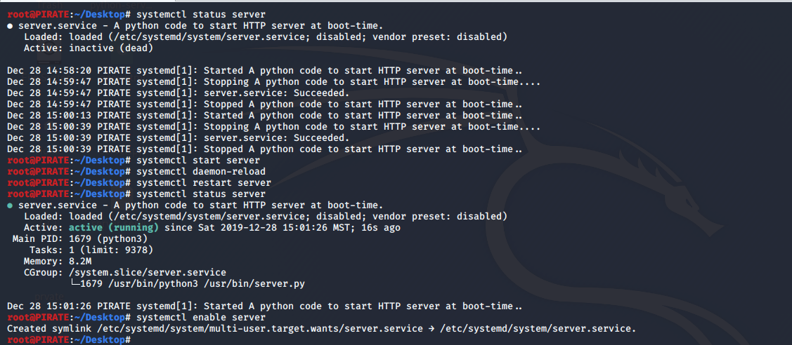
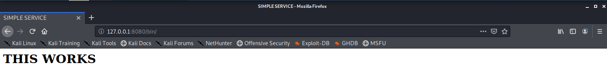

# Systemd-service

## Description:
   Systemd is a Linux tool that includes many features,
   including a bootstrapping system used to start and
   manage system processes.
   
   
   Starting with the **server.py**, a simple python script
   that starts a HTTPServer and displays appropriate message/
   index.html file, thereby achieving the first goal of making
   a server.
   
   
   Then proceeding with the task, the next step was to make a 
   **unit file** in order to define the service. The unit file 
   contains basic instructions of starting the service and rebo
   oting the service at the time of failure.
    
    
   Then proceeding towards the end of the task, I places the python 
   file in the **/usr/bin** folder and the unit file in the **/etc/
   systemd/system** and giving them necessary permissions.
   
   
   The last step was to reload the deamons using command:
   ```bash
   $  sudo systemctl daemon-reload
   ```
   Then starting the service using command and starting it at boot:
   ```bash
   $  sudo systemctl start server
   $  sudo systemclt enable server
   ```
    
  
 ## Status and Output:
    
    
    
       
